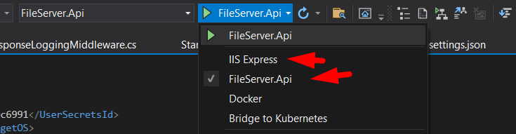
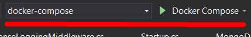
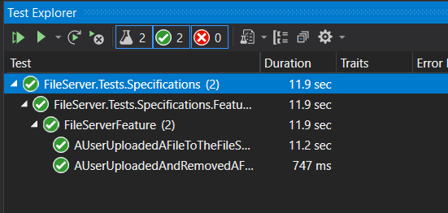
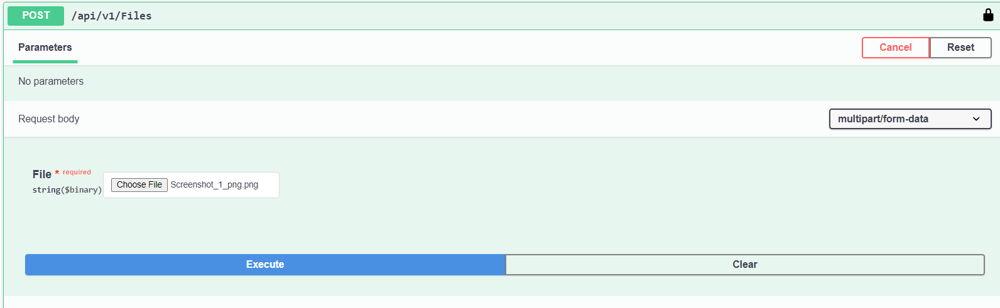
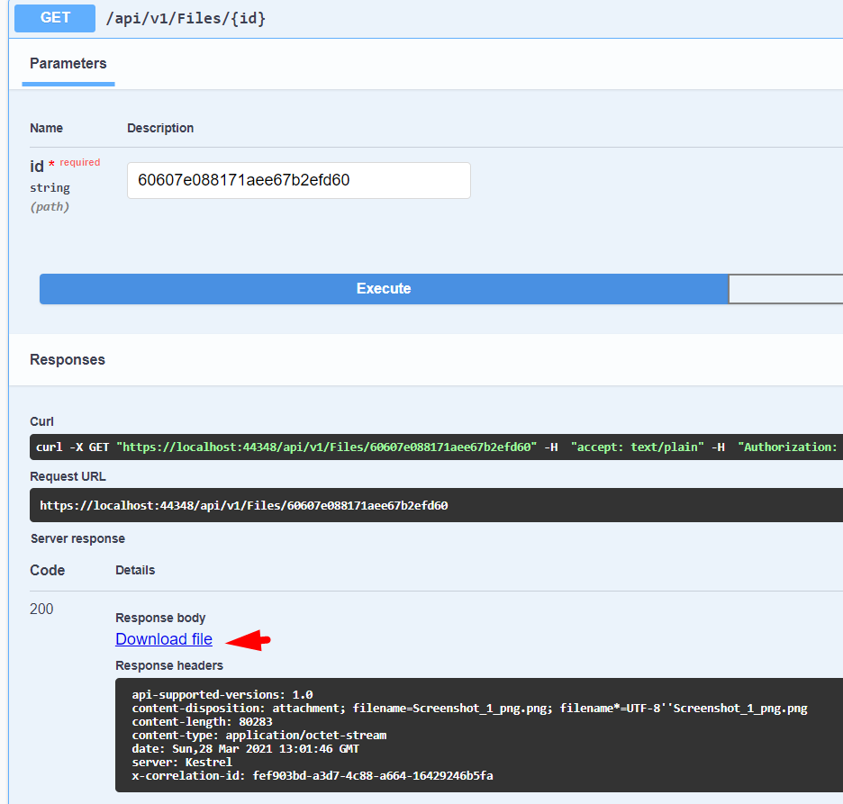

# File Server

The repository contains an [API for a simple file server](https://github.com/romantitov/FileServer/tree/main/backend/src) and [integration tests for the API](https://github.com/romantitov/FileServer/tree/main/tests/src).

## Get started:

0. Install [Docker](https://www.docker.com) 
1. Start server (execute [run.bat](https://github.com/romantitov/FileServer/blob/main/backend/src/run.bat))
    - The step will run docker compose which will install MongoDb and run the API.
    - **Note:** if you have an issue with certificates on this step - try to run the solution in Visual Studio with docker compose (see below), it will install require certificate. After that `run.bat` will also work.
3. Make sure that the API is up and running (open: https://localhost:44348/swagger).
4. Run integration tests (execute [test.bat](https://github.com/romantitov/FileServer/blob/main/tests/src/test.bat))
   - At the end you will see path to test logs in your console

## How to debug API with Visual Studio? 
There are two options:
 1. Without docker compose
    - Install [MongoDb](https://docs.mongodb.com/manual/installation/), or use MongoDB installed in section *Get started* (the [config file](https://github.com/romantitov/FileServer/blob/main/backend/src/FileServer.Api/appsettings.json) already contains connection string for local database).
    - Set *FileServer.Api* as startup project.
    - Use one of two options.
    
    - Press F5.
2. With docker compose
    - Make sure that containers started in section *Get started* are stopped. (Otherwise you will have issues with containers during debug.).
    - Set docker-compose as startup project.
    
    - Press F5.

## Where to find ApiKeys?
You can use any of [ApiKeys from configurations](https://github.com/romantitov/FileServer/blob/main/backend/src/FileServer.Api/appsettings.json) to get access to the API.
 **Note:** enter a key prefixed with `ApiKey `  for example `ApiKey 123`.
 
 ## How to debug integration tests?
  - Make sure that FIle Server API is up and running.
  - Make sure that [configurations](https://github.com/romantitov/FileServer/blob/main/tests/src/FileServer.Tests.Specifications/appsettings.json) contains proper URL to File Server API.
  - Integration tests implemented based on [SpeckFlow](https://specflow.org/). So I would suggest you to install an [extenstion for Visual Studio](https://marketplace.visualstudio.com/items?itemName=TechTalkSpecFlowTeam.SpecFlowForVisualStudio) for better usage experience. 
  - You can find test scenarios [in Feature folder](https://github.com/romantitov/FileServer/blob/main/tests/src/FileServer.Tests.Specifications/Features/FileServer.feature)
  - Once the solution is opened in Visual Studio and build, you can run tests as standart unit tests. Test->Run ALL tests.
    

## What was implemented?
- [x] [RESTful API](https://github.com/romantitov/FileServer/blob/main/backend/src/FileServer.Api/Controllers/FilesController.cs) for uploading/downloading documents and managing metadata.
- [x] [Web API returns meaningful HTTP status codes for all cases](https://github.com/romantitov/FileServer/blob/main/backend/src/FileServer.Api/Middleware/ErrorHandlingMiddleware.cs)
- [x] [Server side caching](https://github.com/romantitov/FileServer/blob/main/backend/src/FileServer.Api/Middleware/Caching/InMemoryCacheMiddleware.cs)
- [x] [Integration tests](https://github.com/romantitov/FileServer/tree/main/tests/src) based on BDD SpeckFlow.
- [x] [Dockerfile](https://github.com/romantitov/FileServer/blob/main/backend/src/FileServer.Api/Dockerfile) with [docker compose](https://github.com/romantitov/FileServer/blob/main/backend/src/docker-compose.yml) 
- [x] [Configurable](https://github.com/romantitov/FileServer/blob/main/backend/src/FileServer.Api/Middleware/Logging/LoggingTypes.cs) [Logging for HTTP incoming requests](https://github.com/romantitov/FileServer/blob/main/backend/src/FileServer.Api/Middleware/Logging/RequestResponseLoggingMiddleware.cs)
- [x] Api [versioning and correlation tracking](https://github.com/romantitov/FileServer/blob/main/backend/src/FileServer.Api/Startup.cs)
- [x] Authentication mechanism based on ApiKey.
- [x] There is no SPA client, but https://localhost:44348/swagger allows to upload/download documents and test all functionality available in the API.

